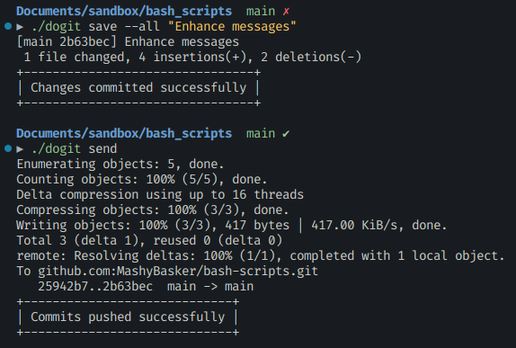

# Bash scripts

To make a bash script a command line utility

1. Create `~/bin` directory
2. `chmod +x <script_file_name>`
3. ` mv <script_file_name> ~/bin`

I pushed `dogit` to Github using `dogit`

